## Team Number \<36> - \<I Voted !>

### Project Overview

The problem statement is given below  

* With everything going online, why not the elections? And the major concern is security! As all elections are not such upscale like the college council elections, Disha Mamani, Vice President, College Council, wants to conduct the college council elections online and wants a secure platform to do so? She has the E-mail IDs of all the students  for any sort of communication. A solution is needed to her problem.

Here we are asked to make a college council election portal to conduct college council elections where the anonymity of the voter is maintained to the admin(which indicates security) knowing that the admin has the email IDs of all the students.

* Team 36 has developed a robust software which insured proper online voting without malicious practices. As mentioned in problem statement, The Admin already has a data set which consist of the Credentials of voters . Upon logging in there would be 2 dashboards for admin and voters respectively, the admin have functionality to add and remove the candidates and veiw results dynamically, Once the voter has voted it will not alllow to vote again

### Solution Description
Team 36 has created 6 data bases- Admin,Voter_Records,President,Cultural,Mess_sec,G_sec respetively.The voters vote will remain anonymous to the admin.  

As mentioned above, we have provided the credientials of the voters and the admin for testing purposes.  

Admin email: xyz@gmail.com Password: ivotexyz   
Some of the voters have already voted.  
Voters List 
1) Email id:gunjan12@gmail.com Password: 123pass  
2) Email id: codershah@gmail.com Password: abcd34   
3) Email id: rohtagilaksh@gmail.com Password: janborn  

If the voter has voted then it will not be allowed to login again and if the votter has provided invalid credientials while logging in, then it will as the voter to try again.   

when the admins logs in it can delete and Add a Candidate details, its aslo has results tabs which show dynmic result for each post  

when the votter logs in to portal the votter redirected to the Vice President voting page  

Once the votter has ticked the choice of candidate and pressed the vote button the votter will be redurected to the voting page for nrxt post and then logout eventally  

All the working video (part1 and part2) is uploaded in link below along with the presentation which provides the details discription
link- https://drive.google.com/drive/folders/1thR8TBWnu5db4uHCOsF6J8cJuKVqbuK2?usp=sharing  

#### Architecture Diagram

 
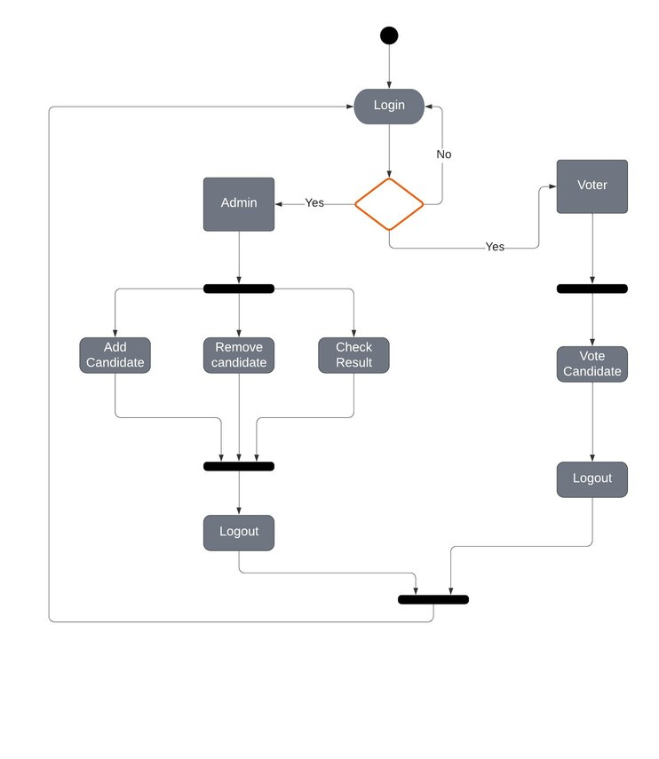
 
 
 
 
 
 
 

#### Technical Description
* What technologies/versions were used  
1-Flask  
2-Inbuilt module SQLite3 database of Python using flask  
3-Python (version-3.8.2)  
4-HTML  
5-CSS  
6-Javascript  
7-Sublime/Atom text editors  

* Setup/Installations required to run the solution  
 Only Flask is required to run the software as we have used the data base proved by sqlite3 which is in bulit in python  
* Instructions to run the submitted code  
py -m venv env  
Pip install flask   
env\scripts\activate  
set FLASK_APP=app.py  
flask run  

### Screenshots

add1.jpeg

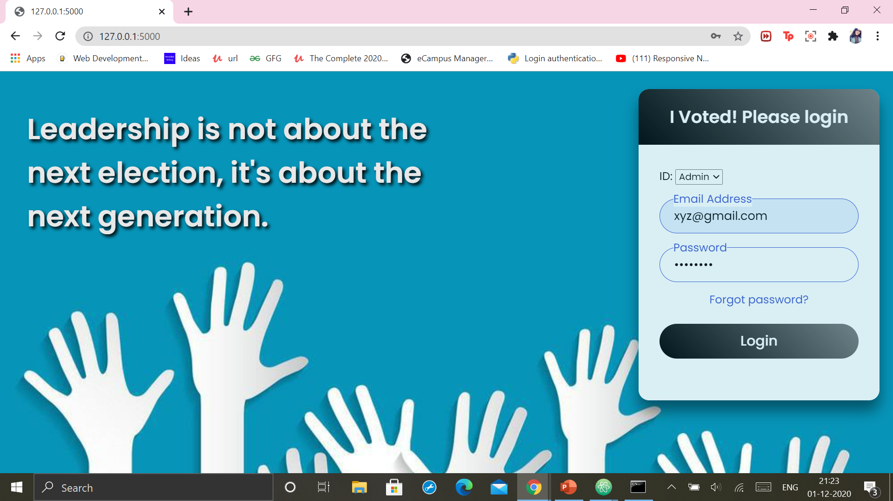  
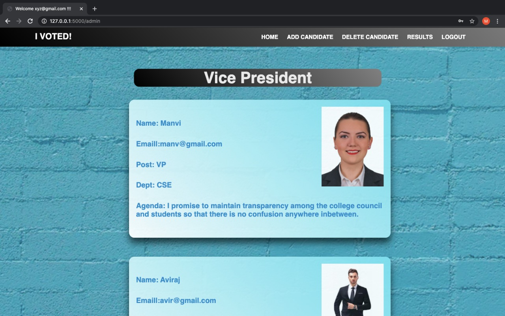  
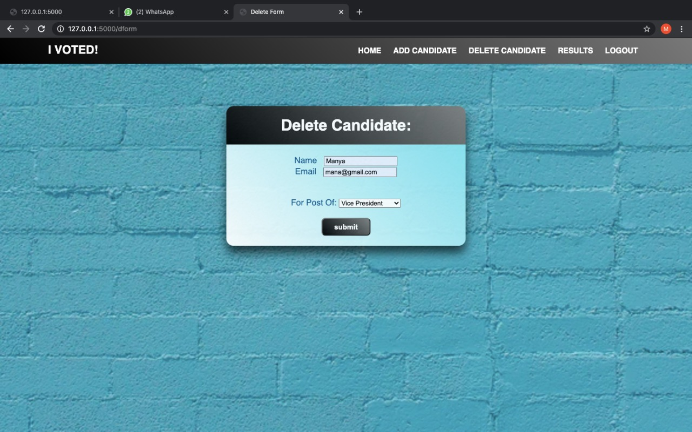  
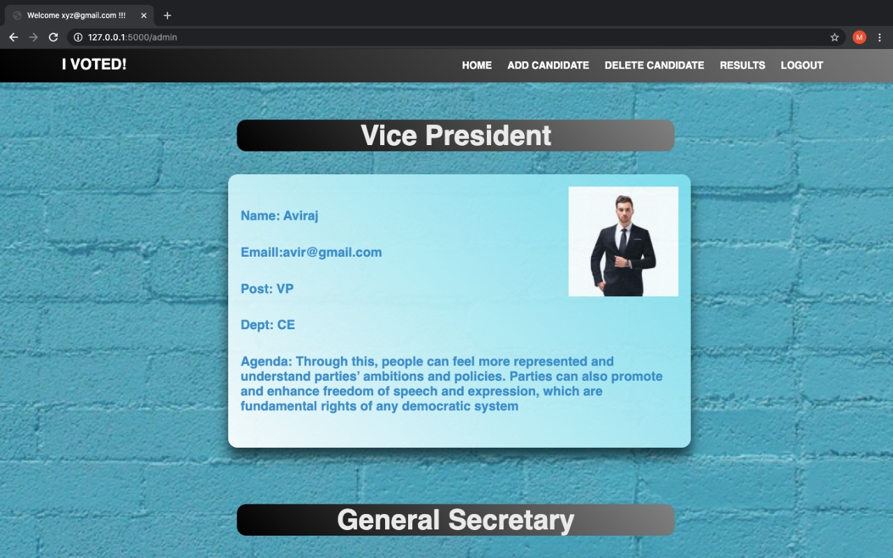  
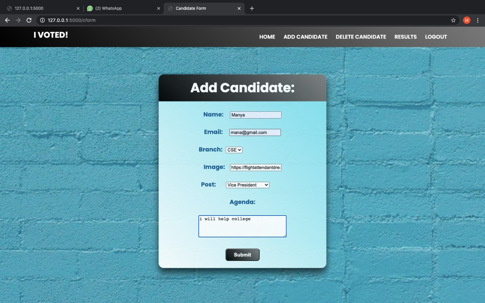  
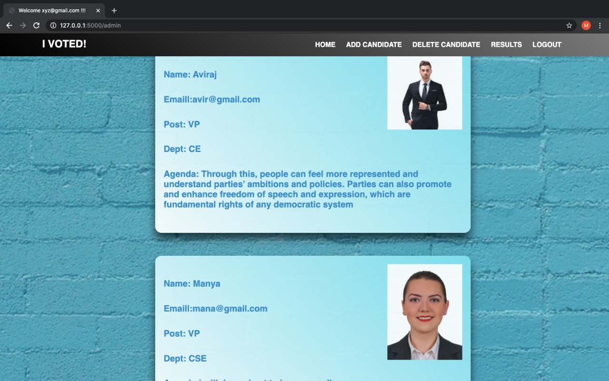  
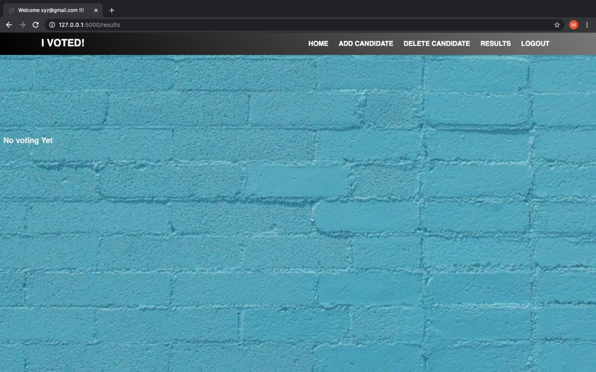  
Condition when no voters have votes.  
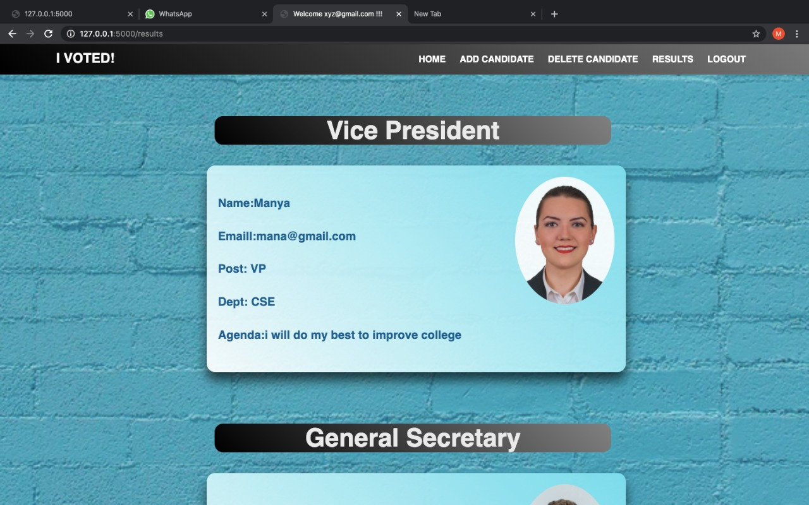  
Condition when voting started.  
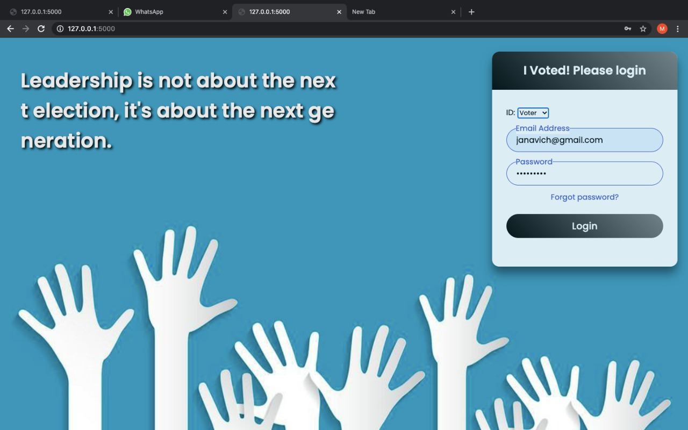  
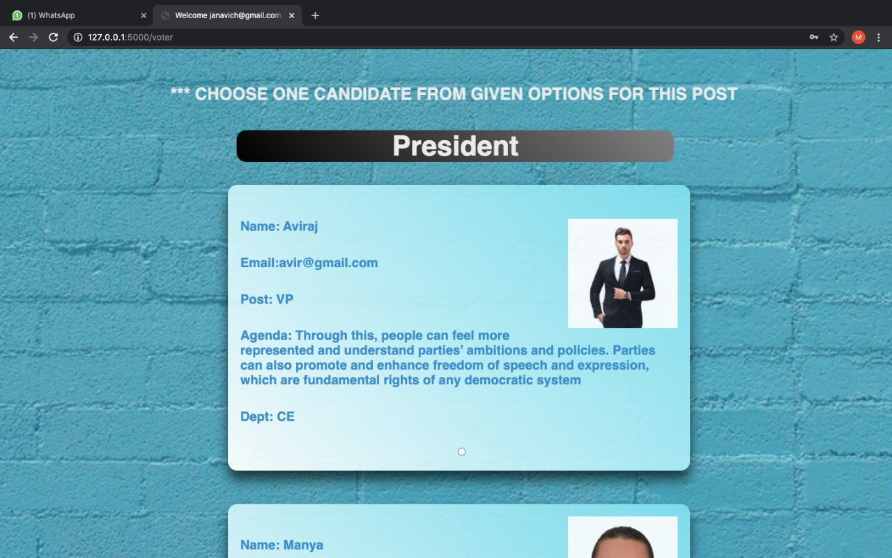  

### Team Members
|Manav Tyagi | manav507@gmail.com|Frontend, Flowchart|   
|Kritika Berry|kritikaberry@gmail.com|Backend and Documentation|  
|Preeti Das|preetidas1609@gmail.com| Frontend, Presentation and Documentation|  

### References
https://stackoverflow.com/  
https://www.javatpoint.com/  
https://www.tutorialspoint.com/sqlite/sqlite_create_database.htm  
https://developer.mozilla.org/en-US/  
https://flask.palletsprojects.com/en/1.1.x/

